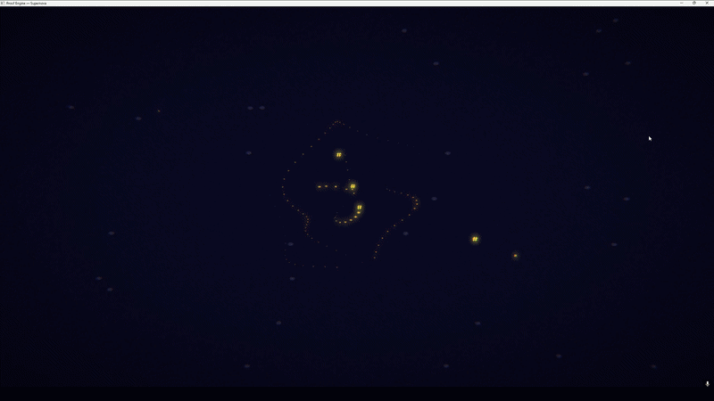
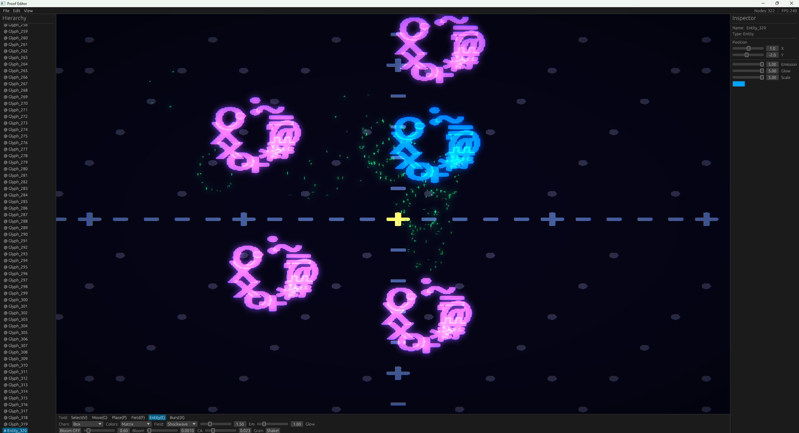

# Proof Engine


## Live Demo

.gif?raw=true)

Two humanoid entities rendered entirely from particles. No meshes. No skeletons. No sprites. Every figure is millions of independent particles held together by spring-force physics — the same way real matter holds its shape through intermolecular forces. When an entity takes damage, it doesn't play a death animation. It physically disintegrates because the forces holding it together are overcome. Destruction, deformation, and fluid behavior all emerge from the same system with zero additional engineering — just different spring constants.

This demo is running with **no lighting pipeline, no shaders, no post-processing, and no material system.** What you're seeing is raw particle simulation only. The engine's full rendering stack — voxel cone traced global illumination, spherical harmonics, Nishita atmospheric scattering, deferred caustics, PBR materials, and volumetric fog — has not been turned on yet. Every particle is a potential light emitter. The visual ceiling scales with particle count, which has no architectural limit.

This is not a particle effect system bolted onto a polygon engine. Particles are the rendering primitive. Everything in the scene is made of them.

A mathematical rendering engine for Rust. Every visual is the output of a real equation.



## What is this?

Proof Engine renders mathematics, not graphics. A Lorenz attractor looks like a Lorenz attractor because particles follow the actual differential equations in real time. Entities are held together by force fields and dissolve into strange attractors when they die. Audio is synthesized from music theory, not audio files.

This is not a traditional game engine. It is a system where the math IS the visual.

## Proof Editor

A visual staging environment for building scenes, placing force fields, and tweaking every parameter in real time. Built with egui on top of the engine viewport.



**Download the editor:** [Releases page](https://github.com/Mattbusel/proof-engine/releases)

### Editor features

- Place glyphs, force fields, and entities by clicking in the viewport
- 10 force field types: Gravity, Vortex, Lorenz, Rossler, Chen, Thomas, Flow, Shockwave, and more
- Live property inspector with position, color, emission, glow sliders
- Hierarchy panel with search, filter, and collapsible tree structure
- Post-processing panel: bloom, chromatic aberration, film grain with preset buttons (Cinematic, Neon, Retro, Clean)
- Asset browser with prefab spawning (Lorenz Cluster, Vortex Ring, etc.)
- Console with command input and color-coded log
- Full undo/redo across all operations
- Save/load scenes to JSON
- Copy/paste, duplicate, box select, multi-select

## Getting started

### Run the editor

Download `proof-editor.exe` from the [Releases page](https://github.com/Mattbusel/proof-engine/releases) and double-click it.

Or build from source:

```
git clone https://github.com/Mattbusel/proof-engine.git
cd proof-engine/editor
cargo run --release
```

### Run the demos

```
cd proof-engine
cargo run --release --example galaxy
cargo run --release --example supernova
cargo run --release --example math_rain
cargo run --release --example heartbeat
```

### Use as a library

```toml
[dependencies]
proof-engine = { git = "https://github.com/Mattbusel/proof-engine.git" }
```

```rust
use proof_engine::prelude::*;

fn main() {
    let mut engine = ProofEngine::new(EngineConfig::default());

    engine.spawn_glyph(Glyph {
        character: '@',
        position: Vec3::ZERO,
        color: Vec4::new(0.0, 1.0, 0.8, 1.0),
        emission: 1.2,
        life_function: Some(MathFunction::Breathing { rate: 0.4, depth: 0.15 }),
        ..Default::default()
    });

    engine.add_field(ForceField::StrangeAttractor {
        attractor_type: AttractorType::Lorenz,
        scale: 0.2,
        strength: 0.4,
        center: Vec3::ZERO,
    });

    engine.run(|_engine, _dt| {});
}
```

## Editor controls

| Key | Action |
|-----|--------|
| Click viewport | Place with current tool |
| WASD / Arrows | Pan camera |
| V | Select tool |
| G | Move tool (drag to reposition) |
| P | Place glyph tool |
| F | Place force field tool |
| E | Place entity tool |
| X | Particle burst tool |
| Shift+Click | Multi-select |
| Ctrl+C / Ctrl+V | Copy / Paste |
| Ctrl+Z / Ctrl+Y | Undo / Redo |
| Ctrl+S / Ctrl+O | Save / Load |
| Ctrl+N | New scene |
| Delete | Remove selection |
| Space | Screen shake |
| F1 | Help |

## Engine capabilities

**Rendering:** OpenGL 3.3, glyph instancing, bloom, chromatic aberration, film grain, vignette, scanlines, motion blur

**Math functions:** Lorenz, Rossler, Chen, Halvorsen, Aizawa, Thomas attractor integration. Sine, cosine, Perlin noise, logistic map, Collatz, golden spiral, Lissajous, Mandelbrot escape, spring-damper systems

**Force fields:** Gravity, vortex, electromagnetic, strange attractor, shockwave, tidal, flow, magnetic dipole. Composable with falloff (linear, inverse square, exponential, Gaussian)

**Physics:** 2D rigid body with SAT collision, soft body mass-spring, Eulerian fluid simulation, constraints and joints

**Audio:** 48kHz synthesis, ADSR envelopes, waveform oscillators, FM synthesis, music theory (scales, chords, progressions), spatial audio with stereo panning and room reverb

**Entities:** Amorphous glyph formations held together by force cohesion. HP-linked binding strength. Dissolve into attractors on death

**Scripting:** Custom bytecode VM with lexer, parser, compiler. Dynamic typing, closures, tables, metatables

**Procedural generation:** Tectonic plates, hydraulic/thermal erosion, climate simulation, biome classification, river networks, cave systems, settlement placement, civilization history, language generation, mythology, genetics

**Ecology:** Lotka-Volterra dynamics, food webs, migration, evolution, SIR disease models

**Narrative:** Story grammars, character motivation, dialogue generation, quest generation, drama management, NPC memory, procedural poetry

## Architecture

460,000+ lines of Rust across the engine, editor, and game frontend.

| Module | Lines | Description |
|--------|-------|-------------|
| game | 28,891 | Boss AI, fluids, cloth, debris, achievements |
| render | 26,849 | OpenGL pipeline, PBR, post-FX, shader graph |
| math | 12,626 | Attractors, fields, curves, noise, springs |
| terrain | 12,505 | Heightmaps, erosion, biomes, streaming |
| physics | 9,018 | Rigid body, soft body, fluid, constraints |
| audio | 8,870 | Synth, music, effects, spatial |
| editor (engine) | 6,883 | State, inspector, hierarchy, console, gizmos |
| ecs | 7,187 | Archetype ECS, generational IDs, queries |
| scripting | 6,933 | Lexer, parser, compiler, bytecode VM |
| worldgen | 3,272 | Tectonics, climate, rivers, caves, history |
| + 45 more modules | ... | ... |

## License

MIT
