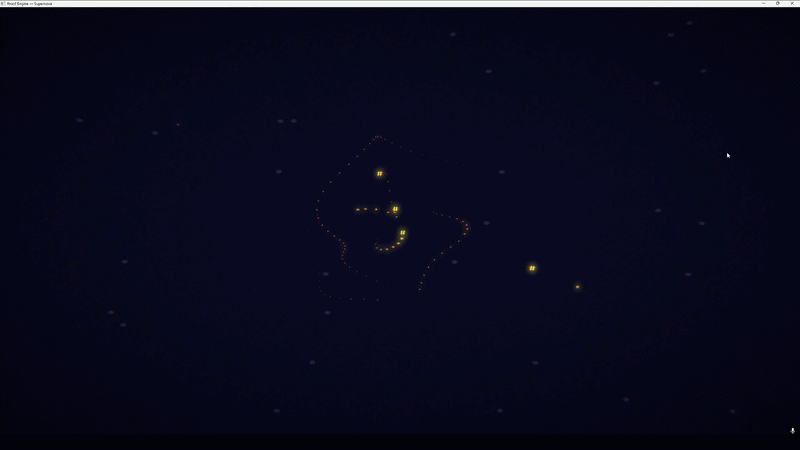
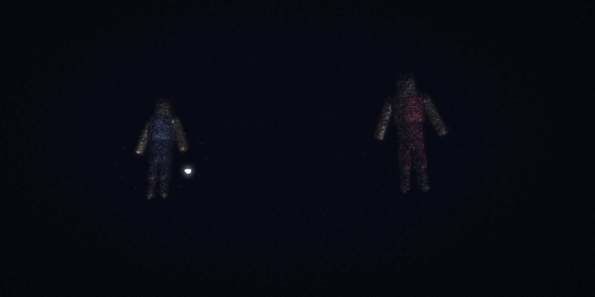
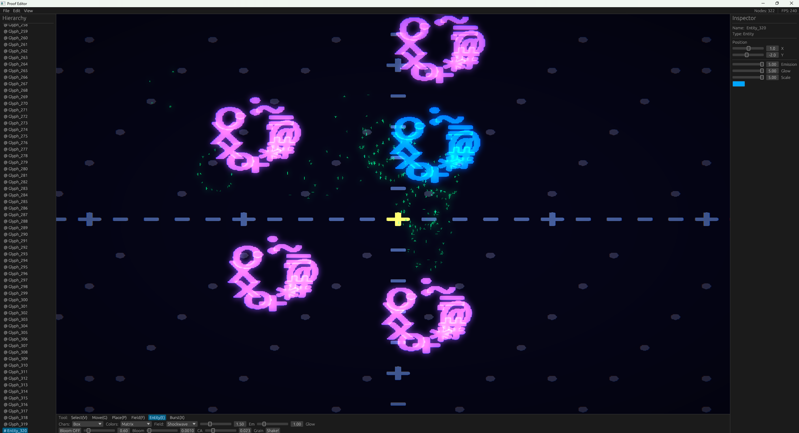

# Proof Engine

[](https://github.com/Mattbusel/proof-engine/actions/workflows/ci.yml)
[](https://crates.io/crates/proof-engine)
[](LICENSE)

**A Rust rendering and game engine where every visual is the output of a mathematical function.** Glyphs and particles are moved by real differential equations, force fields and spring systems, not by sprites, meshes or keyframed animation.

A Lorenz attractor on screen looks like a Lorenz attractor because its particles are integrating the Lorenz equations. An entity is a cluster of glyphs held together by force cohesion; when it loses HP the binding weakens and it comes apart into an attractor instead of playing a death animation. If you like generative art, simulation or procedural games and want an engine built around that idea from the start, this is it.




## What it does

- **OpenGL 3.3 renderer** (glutin, winit, glow) with instanced glyph rendering, bloom, chromatic aberration, film grain, vignette, scanlines and motion blur.
- **Math functions as animation**: Lorenz, Rossler, Chen, Halvorsen, Aizawa and Thomas attractors; sine, Perlin noise, logistic map, Collatz, golden spiral, Lissajous, Mandelbrot escape, spring-damper systems. Any glyph can have a `life_function` that drives its position or color.
- **Composable force fields**: gravity, vortex, electromagnetic, strange attractor, shockwave, tidal, flow, magnetic dipole, entropy and damping, with linear, inverse-square, exponential or Gaussian falloff.
- **Particle-built entities** held together by force cohesion, with HP-linked binding strength.
- **Physics**: 2D rigid bodies with SAT collision, mass-spring soft bodies, Eulerian fluid, constraints and joints.
- **Audio**: 48 kHz synthesis (rodio, cpal), ADSR, FM, music-theory helpers (scales, chords, progressions), stereo panning and reverb.
- **Scripting**: a custom bytecode VM with lexer, parser and compiler, closures and tables.
- **Procedural generation**: tectonics, erosion, climate, biomes, rivers, caves, settlements, history, language and quest generation, plus ecology models (Lotka-Volterra, SIR).
- **Proof Editor**: an egui scene editor for placing glyphs, force fields and entities, with an inspector, hierarchy, post-FX presets, undo/redo and JSON scenes.

The source tree also contains modules for more advanced lighting (a sparse voxel octree GI cone tracer, Nishita sky scattering, tiled and deferred lighting, volumetric fog, a wgpu backend). The Nishita sky model drives the `sky` example; the others exist as code but are not yet connected to any demo.

## The screen pipeline

What actually runs on the GPU every frame, in order:

```text
scene FBO (RGBA16F x2: colour, emission) at render_scale
  3D glyph pass ─┐
  UI world pass ─┤  (UiPass::World: particle clouds, filled rects, panel fills)
                 ├─ emission ─► bloom pyramid: soft-knee threshold, blur down, tent up
                 └─ colour ────► composite ─► [FXAA] ─► screen ─► UI HUD pass
                                   (UiPass::Hud: text, borders, bars, sprites)
```

The scene buffers are half-float, so a few hundred thousand overlapping
emissive particles accumulate real light instead of clipping at white. The
composite is the one place the range comes down, through ACES.

**Two UI passes.** `engine.ui` routes every command to a pass. Particle
clouds and filled rectangles default to the world pass, which is painted into
the HDR buffer before post-processing; text, outlines, bars and sprites
default to the HUD pass, painted sharp on top afterwards. A panel splits: fill
to the world, border to the HUD. `ui.begin_world()`, `ui.begin_hud()` and
`ui.end_pass()` override the default for a run of commands. A game that draws
its whole picture as screen-space matter gets bloom, grade, lens and grain on
all of it, and a readable interface over that.

**What the composite does, in order:** shockwave refraction, heat haze, barrel
lens, chromatic aberration, unsharp mask, floor reflection, exposure,
screen-space indirect light (matter near a lit thing is lit by it), bloom,
halation, light shafts, lens flare, flash, ACES tonemap, lift/gain grade,
tint, contrast, saturation, vignette, shadow-weighted grain, ordered dither,
scanlines. Every standing parameter is a field on `RenderConfig`; the moments
are on `engine.fx`.

**`engine.fx` (ScreenFx).** Fire-and-forget effects that decay on their own:
`shockwave(x, y, strength)`, `flash(color, strength)`,
`light_shaft_at(x, y, strength)` or `auto_shafts = true` to stream from
whatever is brightest on screen, `reflect_at(y, strength, fade)` for a glossy
floor, and `haze` for heat shimmer. Coordinates are UI pixels.

**Lights and shadows.** `engine.fx.light(x, y, radius, color, intensity)`
and `engine.fx.ambient`. The glyph pass writes an occluder buffer (matter,
never floors or panel fills); the light pass marches shadows through it
from every light and the composite multiplies the scene by the result.
Emissive matter lights itself. `config.persistence` keeps a decaying copy
of last frame's scene under this one, for motion trails.

**GPU density entities.** `engine.init_gpu_density(n)` and
`engine.queue_gpu_density_entity(data)`: sixteen bones become millions of
particles derived in the vertex shader from the instance index, with
breathing, jitter and matter that comes loose as `hp` falls. Nothing per
particle ever leaves the GPU. See `examples/colossus.rs`.

**Sound.** A `MathAudioSource` now carries a pitch envelope, a second
partial, a noise mix, biquad or comb filters, drive, a reverb send, and a
start delay, and the output thread honours all of it, with separate music
and effects buses, ducking, a master reverb and a soft limiter. A blow is a
crack, a thud and a ring; before, it was a sine.

**Also:** `render_scale` renders the scene at a fraction of the window and
upsamples; `fxaa` runs a real FXAA 3.11 pass between the composite and the
HUD; `shake_pixels` moves the world pass with camera trauma while the HUD
stays put; `vsync` waits for the display.

## Quick start

You need a Rust toolchain (stable) and a GPU with OpenGL 3.3 or newer.

- **Windows:** nothing else.
- **macOS:** nothing else. macOS stops at OpenGL 4.1, so `apotheosis` (which uses 4.3 compute shaders) will not run there; every other demo does.
- **Linux:** the audio backend needs the ALSA headers: `sudo apt install libasound2-dev pkg-config` (Debian/Ubuntu) or `sudo dnf install alsa-lib-devel` (Fedora).

```bash
git clone https://github.com/Mattbusel/proof-engine.git
cd proof-engine
cargo run --release --example convergence     # the demo in the screenshots
```

The first build compiles the whole engine and takes a few minutes. Use `--release`: the demos simulate tens of thousands of particles per frame and a debug build is too slow to judge them by.

## Demos

Every demo is `cargo run --release --example <name>`. Close the window (or press Esc where noted) to quit.

| Example | What you see |
| --- | --- |
| `convergence` | Two particle-built fighters in a circular arena with an orbiting camera; combat loops forever and hits knock matter loose. The screenshots at the top of this page. |
| `supernova` | A star pulses, collapses under a gravity field, explodes into debris and settles into a Lorenz-attractor nebula. The GIF at the top. |
| `galaxy` | 3000+ glyphs on golden-ratio spiral arms around a central black hole, with nebula clouds on Perlin noise. |
| `sky` | A day passing over a mountain range. Every sky cell is the Nishita Rayleigh + Mie scattering integral for its view direction, recomputed each frame. Space pauses, Up/Down change speed, Esc quits. |
| `math_rain` | Digital rain where each column follows a different function: linear, sine, logistic map, Collatz, Perlin. |
| `strange_attractors` | Seven attractors (Lorenz, Rossler, Chen, Halvorsen, Aizawa, Thomas, Dadras) side by side as particle trails. |
| `hello_glyph` | The smallest program: one breathing `@` and a gravity field. Start here when reading code. |
| `playground` | Interactive sandbox: place glyphs, fields and entities with the mouse, cycle attractors and palettes. |
| `colossus` | GPU density entities: millions of particles derived in the vertex shader from sixteen bones. Needs a strong GPU. |
| `apotheosis` | A particle-rendered character built on signed distance fields, about 10.8 million GPU particles. Needs OpenGL 4.3 and a strong GPU. |

Also: `chaos_field`, `particle_demo`, `force_fields`, `amorphous_entity`, `particle_entity`, `full_combat`, `heartbeat`, `showcase`, `sculptor`.



Benchmarks: `cargo bench` (Criterion: `particle_bench`, `glyph_bench`).

### Use as a library

```toml
[dependencies]
proof-engine = "0.2"
```

```rust
use proof_engine::prelude::*;

fn main() {
    let mut engine = ProofEngine::new(EngineConfig::default());

    engine.spawn_glyph(Glyph {
        character: '@',
        position: Vec3::ZERO,
        color: Vec4::new(0.0, 1.0, 0.8, 1.0),
        emission: 1.2,
        life_function: Some(MathFunction::Breathing { rate: 0.4, depth: 0.15 }),
        ..Default::default()
    });

    engine.add_field(ForceField::StrangeAttractor {
        attractor_type: AttractorType::Lorenz,
        scale: 0.2,
        strength: 0.4,
        center: Vec3::ZERO,
    });

    engine.run(|_engine, _dt| {});
}
```

## Proof Editor



Download `proof-editor.exe` (Windows) from the [releases page](https://github.com/Mattbusel/proof-engine/releases), or build it:

```bash
cd proof-engine/editor
cargo run --release
```

| Key | Action |
| --- | --- |
| Click viewport | Place with current tool |
| WASD / arrows | Pan camera |
| V / G / P / F / E / X | Select, move, place glyph, place force field, place entity, particle burst |
| Shift+Click | Multi-select |
| Ctrl+C / Ctrl+V | Copy / paste |
| Ctrl+Z / Ctrl+Y | Undo / redo |
| Ctrl+S / Ctrl+O / Ctrl+N | Save / load / new scene |
| Delete | Remove selection |
| Space | Screen shake |
| F1 | Help |

## Architecture

Roughly 660,000 lines of Rust across the engine (`src/`), the editor (`editor/`) and the examples. The largest engine modules:

| Module | Contents |
| --- | --- |
| `render` | OpenGL pipeline, post-FX, shader graph |
| `math` | attractors, fields, curves, noise, springs, `MathFunction` evaluation |
| `glyph`, `particle`, `entity` | the core primitives and their pools |
| `physics` | rigid body, soft body, fluid, constraints |
| `audio`, `dsp` | synthesis, music theory, effects, spatial audio |
| `ecs` | archetype ECS with generational IDs |
| `scripting` | lexer, parser, compiler, bytecode VM |
| `terrain`, `worldgen`, `ecology`, `narrative` | procedural generation |
| `game` | boss AI, cloth, debris, achievements |
| `nishita_sky` | physical sky scattering, used by the `sky` example |
| `svogi`, `volumetric_fog`, `tiled_lighting`, `wgpu_backend` | advanced lighting, not yet wired into the demos |

### The `apotheosis` example

`examples/apotheosis.rs` is a standalone showcase of a particle-rendered character built on signed distance fields instead of meshes. A 26-bone capsule skeleton is blended with Inigo Quilez's polynomial smooth minimum, particles are importance-sampled onto the SDF shell, and normals, ambient occlusion and subsurface thickness are all computed from the SDF itself. On top of that it layers per-material shading (Schlick Fresnel, Kajiya-Kay hair and fabric specular, thin-film iridescence), a strand-based hair renderer, inertial lag for loose materials, and a post stack including TAA jitter, spectral bloom, god rays, depth of field bokeh and ACES tonemapping. It targets about 10.8 million GPU particles.

## Related

[chaos-rpg](https://github.com/Mattbusel/chaos-rpg) is a roguelike whose graphical frontend runs on Proof Engine. `CHAOS_RPG_API_CONTRACT.md` documents what the engine has to support for it.

## Status

Early (0.1.x) and moving fast. The public API is not stable and some subsystems are further along than others. CI builds every target and runs the unit, integration and doc tests on Linux, and builds the examples on Windows and macOS. About 4,800 library unit tests pass; the ones that do not yet are listed by name in [`ci/known-failing-tests.txt`](ci/known-failing-tests.txt), and each one fixed is a line deleted from that file. Contributions: see [CONTRIBUTING.md](CONTRIBUTING.md).

## License

MIT, see [LICENSE](LICENSE).


## Hire the author

**Need this kind of engineering on your product?** I take on a small number of client builds: LLM features, iOS apps and performance work, fixed price. [Services and pricing](https://mattbusel.github.io/) · [Email](mailto:mattbusel@gmail.com) · [LinkedIn](https://www.linkedin.com/in/matthewbusel/)
