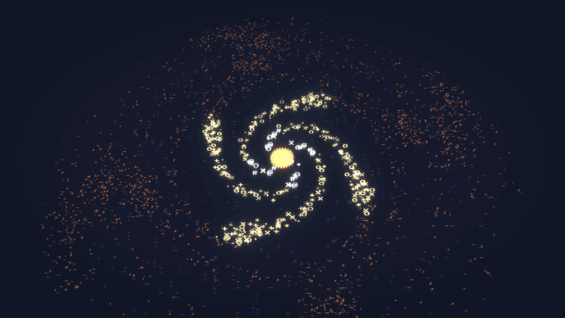
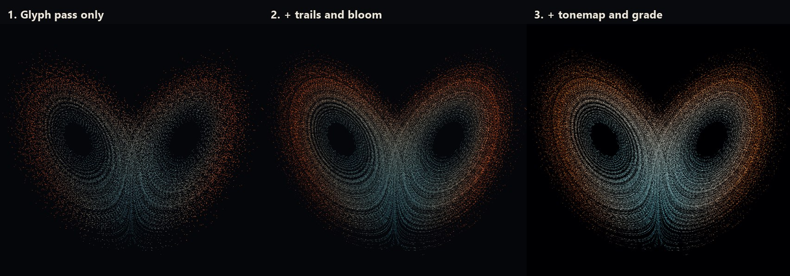
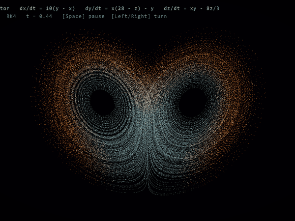
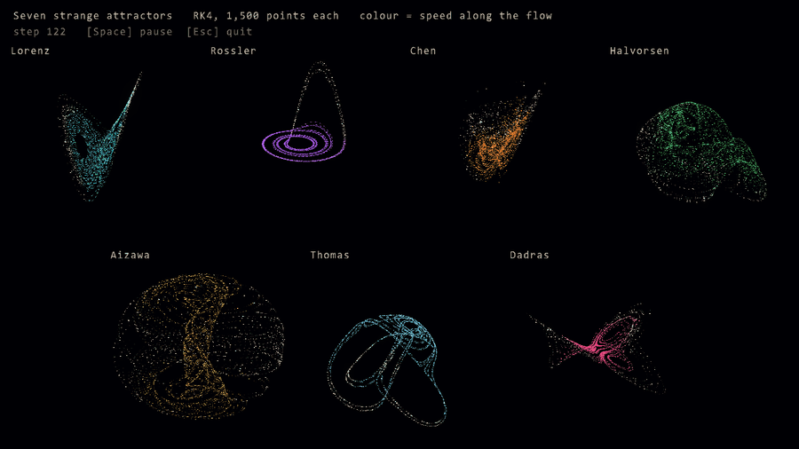
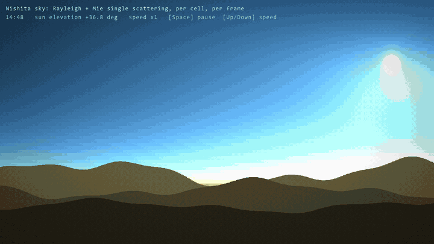
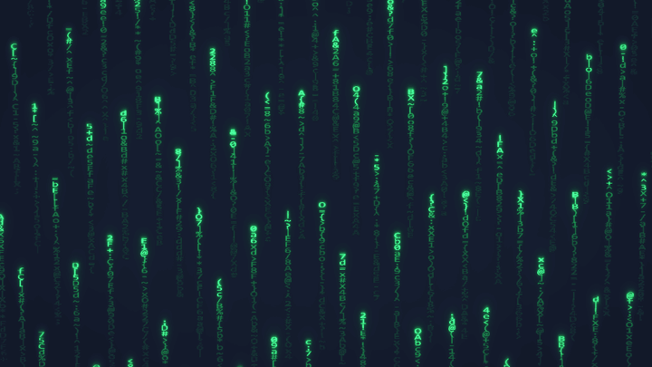
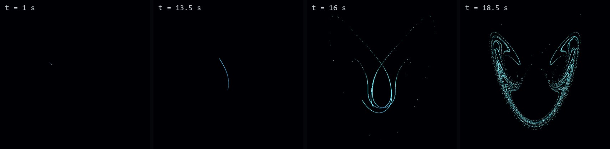

<h1 align="center">Proof Engine</h1>

<p align="center"><b>Write the equations, and Proof Engine draws what they do: moving pictures made from math, in real time, with glowing HDR light.</b></p>

<p align="center">A Rust graphics engine and a set of ready-to-run demos. For creative coders, generative artists, and anyone who wants to watch a strange attractor or a physical sky move.</p>

<p align="center">
  <a href="https://gitlab.com/mattbusel/proof-engine/-/releases/permalink/latest/downloads/proof-lorenz.exe"><b>Download for Windows (.exe)</b></a> &nbsp;&middot;&nbsp;
  <a href="#download">macOS and Linux</a> &nbsp;&middot;&nbsp;
  <a href="https://proof-engine-rs.vercel.app/">Site</a> &nbsp;&middot;&nbsp;
  <a href="https://docs.rs/proof-engine">docs.rs</a> &nbsp;&middot;&nbsp;
  <a href="https://crates.io/crates/proof-engine"></a>
</p>

<p align="center"></p>
<p align="center"><sub>The <code>galaxy</code> demo, recorded from the engine's own framebuffer.</sub></p>

Proof Engine is a real-time generative art and math visualization engine written in Rust on OpenGL. Points and glyphs are moved by differential equations (the Lorenz attractor and six other strange attractors), force fields and physics, then drawn through a half-float HDR pipeline with bloom and an ACES tonemap.

## Download

| System | Download |
| --- | --- |
| **Windows** | [**proof-lorenz.exe**](https://gitlab.com/mattbusel/proof-engine/-/releases/permalink/latest/downloads/proof-lorenz.exe): double-click it. Or [all 10 demos and the editor (.zip)](https://gitlab.com/mattbusel/proof-engine/-/releases/permalink/latest/downloads/proof-engine-demos-windows-x64.zip). |
| **macOS** (Apple silicon / Intel) | [demos for arm64](https://gitlab.com/mattbusel/proof-engine/-/releases) / [demos for x64](https://gitlab.com/mattbusel/proof-engine/-/releases) |
| **Linux** (x86_64) | [proof-engine-demos-linux-x64.tar.gz](https://gitlab.com/mattbusel/proof-engine/-/releases/permalink/latest/downloads/proof-engine-demos-linux-x64.tar.gz) |
| **Your own Rust program** | `cargo add proof-engine` |

No Rust needed for the downloads, just a GPU with OpenGL 3.3 or newer. Unsigned files: on Windows click *More info*, then *Run anyway*; the macOS and Linux notes are in [docs/INSTALL.md](docs/INSTALL.md).

## Math screensaver

Ten of the engine's strange attractors as a Windows screensaver, one after another, every point moved by its equations live. Download [**proof-screensaver.scr**](https://gitlab.com/mattbusel/proof-engine/-/releases/permalink/latest/downloads/proof-screensaver.scr), put it somewhere it can stay, then right-click it and choose **Install** (or copy it into `C:\Windows\System32` and pick *proof-screensaver* in Screen Saver Settings). **Settings...** there opens its own options. More, including uninstalling: [docs/SCREENSAVER.md](docs/SCREENSAVER.md).

## How it works



Every frame: your code moves the points with plain math, the engine turns each point into a glyph, the GPU adds up their light in an HDR buffer, and the composite turns that light into the picture. Here is the same real frame captured after each stage:



## Examples

Each one is a real capture of `cargo run --release --example <name>` (or the matching `proof-<name>.exe`).

| `lorenz` | `strange_attractors` |
| --- | --- |
|  |  |
| 40,000 points riding the Lorenz equations. Nobody drew the wings; the equations put the points there. | Seven chaotic systems side by side, 1,500 points each. Colour is speed. |
| **`sky`** | **`math_rain`** |
|  |  |
| A day passing. Every sky cell is a Rayleigh and Mie scattering integral, every frame. | Falling math symbols; speeds from a sine, flicker from a logistic map. |

All 21 demos and their controls: [docs/DEMOS.md](docs/DEMOS.md).

## Use it in 3 steps

**1. Make a project and add the engine.**

```bash
cargo new lorenz-demo && cd lorenz-demo
cargo add proof-engine
```

**2. Replace `src/main.rs` with this** (also in the repo as [`examples/quickstart.rs`](examples/quickstart.rs)):

```rust
use proof_engine::math::attractors::rk4_step;
use proof_engine::prelude::*;
use proof_engine::render::ui_layer::UiParticle;

fn main() {
    let mut engine = ProofEngine::new(EngineConfig::default());

    // 5,000 points in a line 2 units long, each 0.0004 from the next.
    let mut points: Vec<Vec3> = (0..5000)
        .map(|i| Vec3::new(1.0 + i as f32 * 4e-4, 1.0, 1.0))
        .collect();

    engine.run_ui(move |engine, dt| {
        // Advance every point along the Lorenz equations.
        for p in points.iter_mut() {
            *p = rk4_step(AttractorType::Lorenz, *p, dt);
        }
        // Draw them: x across, z up, centred in the window.
        let (w, h) = engine.render_size();
        let (cx, cy, s) = (w as f32 / 2.0, h as f32 / 2.0, h as f32 / 60.0);
        let color = Vec4::new(0.5, 1.2, 1.6, 1.0);
        let dots = points
            .iter()
            .map(|p| UiParticle::new(cx + p.x * s, cy - (p.z - 25.0) * s, 3.0, 3.0, '●', color))
            .collect();
        engine.ui.draw_particles(dots);
    });
}
```

**3. Run it** with `cargo run --release`. The points travel together as one streak for about ten seconds, then chaos pulls them apart into the Lorenz butterfly:



Linux needs the ALSA headers first (`sudo apt install libasound2-dev pkg-config`). Always build with `--release`.

## More you can do without opening a window

**Record a GIF of any demo.** No screen recorder needed: the engine reads its own frames back and writes the GIF itself. The window stays hidden while it works.

```bash
PROOF_HIDDEN=1 PROOF_FIXED_DT=30 PROOF_SHOT=lorenz.gif PROOF_SHOT_AT=300 \
PROOF_SHOT_COUNT=120 PROOF_SHOT_WIDTH=480 cargo run --release --example lorenz
```

Use `.png` or `.jpg` instead for a single picture. All the settings are in [docs/CAPTURE.md](docs/CAPTURE.md).

**Try your own equations without recompiling.** Write the system in a few lines of [Rhai](https://rhai.rs), a small scripting language. Here is the whole Thomas attractor:

```text
let b = 0.208186;
[sin(y) - b * x, sin(z) - b * y, sin(x) - b * z]
```

Then draw it, and keep it redrawing every time you save the file:

```bash
cargo run --release --example scripted_attractor -- examples/scripts/thomas.rhai thomas.png --dt 0.05 --map turbo --watch
```

If you save a typo, it tells you where and keeps the last picture that worked. In your own program, `math::scripted::ScriptedSystem` does the same inside the frame loop.

**Colour with real colour maps.** `math::color::preset_gradient("viridis")` gives you any of 38 standard maps (viridis, magma, turbo, cubehelix, the ColorBrewer sets), and `Gradient::from_css("#000, deeppink 40%, gold")` takes a CSS gradient.

**Render sound to a file.** `audio::OfflineRenderer` runs the engine's synthesiser with no sound card and `audio::wav::write_wav` saves it. Try `cargo run --release --example audio_bounce`.

**Use every core.** `math::attractors::rk4_step_all(kind, &mut points, dt)` steps a whole slice; with the `parallel` feature it runs on all cores with rayon. On an i7-13700KF, 40,000 Lorenz points take 1.21 ms per frame on one core and 0.10 ms with `parallel` (`cargo bench --bench attractor_bench`). Results are bit-identical either way.

## Cargo features

| Feature | Default | What it adds |
| --- | --- | --- |
| `rhai-scripts` | on | `math::scripted`: systems written in Rhai, hot reloaded |
| `parallel` | off | multi-core `rk4_step_all` (rayon) |
| `http` | off | real requests for `networking::http`, the leaderboard and analytics clients (ureq, rustls) |
| `websocket` | off | real `ws://` / `wss://` connections for `networking::websocket` (tungstenite, rustls) |
| `net` | off | `http` + `websocket` |

Without `http` / `websocket` the networking clients report an error instead of touching the network. No feature pulls in OpenSSL.

## How it compares

- **[nannou](https://crates.io/crates/nannou)** is a general creative-coding framework (wgpu, draw API, audio, OSC). Pick it for general sketches.
- **[macroquad](https://crates.io/crates/macroquad)** is a small game library that also runs on the web. Pick it for 2D games, especially in the browser.
- **Proof Engine** is narrower: the scene is glyphs and particles moved by equations, drawn through an HDR bloom pipeline, with attractors, force fields, colour maps, scripted systems and frame capture built in. The equations themselves are checked against the [ode_solvers](https://crates.io/crates/ode_solvers) crate in the test suite (Lorenz, Rossler, Thomas, Aizawa and Chen, written out independently).

## Documentation

| Doc | What is in it |
| --- | --- |
| [Install and run](docs/INSTALL.md) | Every download, macOS/Linux notes, building from source, project status |
| [Demos](docs/DEMOS.md) | All 21 examples with pictures and controls, the sky and Lorenz write-ups |
| [How it works](docs/ARCHITECTURE.md) | The frame pipeline, `engine.fx`, lights, GPU density, sound, what each module holds |
| [Capture frames](docs/CAPTURE.md) | `PROOF_SHOT` and `PROOF_HIDDEN`: record any program's frames without a window appearing |
| [Proof Editor](docs/EDITOR.md) | The scene editor, its download and keys |
| [Screensaver](docs/SCREENSAVER.md) | Proof Saver: install, settings, live-art mode, building the .scr |
| [docs.rs](https://docs.rs/proof-engine) | The full API |
| [Changelog](CHANGELOG.md) · [Contributing](CONTRIBUTING.md) | Release history and how to send a change |

[chaos-rpg](https://gitlab.com/mattbusel/chaos-rpg) is a roguelike whose graphical frontend runs on Proof Engine; [`CHAOS_RPG_API_CONTRACT.md`](CHAOS_RPG_API_CONTRACT.md) documents what it needs.

## Built with

Windowing and OpenGL come from [winit](https://crates.io/crates/winit), [glutin](https://crates.io/crates/glutin) and [glow](https://crates.io/crates/glow); maths from [glam](https://crates.io/crates/glam); text from [ab_glyph](https://crates.io/crates/ab_glyph); sound output from [cpal](https://crates.io/crates/cpal). Image files and GIFs are handled by [image](https://crates.io/crates/image), WAV files by [hound](https://crates.io/crates/hound), colour maps by [colorgrad](https://crates.io/crates/colorgrad), scripts by [rhai](https://crates.io/crates/rhai) and save files by [serde_json](https://crates.io/crates/serde_json).

## License

MIT, see [LICENSE](LICENSE).

## Hire the author

**Need this kind of engineering on your product?** I take on a small number of client builds: LLM features, iOS apps and performance work, fixed price. [Services and pricing](https://mattbusel.vercel.app/) · [Email](mailto:mattbusel@gmail.com) · [LinkedIn](https://www.linkedin.com/in/matthewbusel/)
