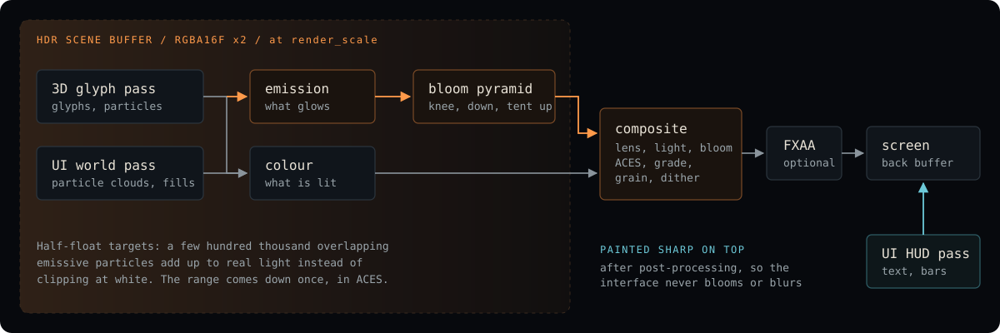

# How Proof Engine works

[README](../README.md) · [Install](INSTALL.md) · [Demos](DEMOS.md) · [How it works](ARCHITECTURE.md) · [Capture](CAPTURE.md) · [Editor](EDITOR.md)

## How math becomes a frame

The same frame captured at each stage, by switching `RenderConfig` fields off (bloom, persistence, tonemap, vignette) and reading the framebuffer back with `PROOF_SHOT`:

In code, one frame of `ProofEngine::run_ui` is: poll input, `scene.tick(dt)` (force fields and physics), your `update` closure (where the math runs and `engine.ui.draw_particles` queues glyphs), `Pipeline::render_frame` (build one `GlyphInstance` per glyph, draw them instanced into the HDR scene buffer, then the UI world pass into the same buffer, then `PostFxPipeline::run`: persistence, lights, bloom down and up the pyramid, composite, optional FXAA), `Pipeline::render_ui` (the HUD, sharp on top), an optional `PROOF_SHOT` read-back, and the buffer swap.

## The screen pipeline

The scene buffers are half-float, so a few hundred thousand overlapping emissive particles accumulate real light instead of clipping at white. The composite is the one place the range comes down, through ACES.

### Pipeline reference

**Two UI passes.** `engine.ui` routes every command to a pass. Particle
clouds and filled rectangles default to the world pass, which is painted into
the HDR buffer before post-processing; text, outlines, bars and sprites
default to the HUD pass, painted sharp on top afterwards. A panel splits: fill
to the world, border to the HUD. `ui.begin_world()`, `ui.begin_hud()` and
`ui.end_pass()` override the default for a run of commands. A game that draws
its whole picture as screen-space matter gets bloom, grade, lens and grain on
all of it, and a readable interface over that.

**What the composite does, in order:** shockwave refraction, heat haze, barrel
lens, chromatic aberration, unsharp mask, floor reflection, exposure,
screen-space indirect light (matter near a lit thing is lit by it), bloom,
halation, light shafts, lens flare, flash, ACES tonemap, lift/gain grade,
tint, contrast, saturation, vignette, shadow-weighted grain, ordered dither,
scanlines. Every standing parameter is a field on `RenderConfig`; the moments
are on `engine.fx`.

**`engine.fx` (ScreenFx).** Fire-and-forget effects that decay on their own:
`shockwave(x, y, strength)`, `flash(color, strength)`,
`light_shaft_at(x, y, strength)` or `auto_shafts = true` to stream from
whatever is brightest on screen, `reflect_at(y, strength, fade)` for a glossy
floor, and `haze` for heat shimmer. Coordinates are UI pixels.

**Lights and shadows.** `engine.fx.light(x, y, radius, color, intensity)`
and `engine.fx.ambient`. The glyph pass writes an occluder buffer (matter,
never floors or panel fills); the light pass marches shadows through it
from every light and the composite multiplies the scene by the result.
Emissive matter lights itself. `config.persistence` keeps a decaying copy
of last frame's scene under this one, for motion trails.

**GPU density entities.** `engine.init_gpu_density(n)` and
`engine.queue_gpu_density_entity(data)`: sixteen bones become millions of
particles derived in the vertex shader from the instance index, with
breathing, jitter and matter that comes loose as `hp` falls. Nothing per
particle ever leaves the GPU. See `examples/colossus.rs`.

**Sound.** A `MathAudioSource` carries a pitch envelope, a second
partial, a noise mix, biquad or comb filters, drive, a reverb send, and a
start delay, and the output thread honours all of it, with separate music
and effects buses, ducking, a master reverb and a soft limiter. A blow is a
crack, a thud and a ring.

**Also:** `render_scale` renders the scene at a fraction of the window and
upsamples; `fxaa` runs a real FXAA 3.11 pass between the composite and the
HUD; `shake_pixels` moves the world pass with camera trauma while the HUD
stays put; `vsync` waits for the display.

## What it does

| Area | What is there |
| --- | --- |
| **Math functions as animation** | Lorenz, Rossler, Chen, Halvorsen, Aizawa, Thomas and Dadras attractors; sine, Perlin noise, logistic map, Collatz, golden spiral, Lissajous, Mandelbrot escape, spring-damper systems. Any glyph can have a `life_function` that drives its position or color. |
| **Composable force fields** | Gravity, vortex, electromagnetic, strange attractor, shockwave, tidal, flow, magnetic dipole, entropy and damping, with linear, inverse-square, exponential or Gaussian falloff. |
| **Particle-built entities** | Held together by force cohesion, with HP-linked binding strength. |
| **OpenGL 3.3 HDR renderer** | glutin, winit and glow; instanced glyph rendering, half-float scene buffers, bloom, ACES, chromatic aberration, film grain, vignette, scanlines and motion blur. |
| **Physics** | 2D rigid bodies with SAT collision, mass-spring soft bodies, Eulerian fluid, constraints and joints. |
| **Audio** | 48 kHz synthesis (rodio, cpal), ADSR, FM, music-theory helpers (scales, chords, progressions), stereo panning and reverb. |
| **Scripting** | A custom bytecode VM with lexer, parser and compiler, closures and tables. |
| **Procedural generation** | Tectonics, erosion, climate, biomes, rivers, caves, settlements, history, language and quest generation, plus ecology models (Lotka-Volterra, SIR). |
| **Proof Editor** | An egui scene editor for placing glyphs, force fields and entities, with an inspector, hierarchy, post-FX presets, undo/redo and JSON scenes. |

The source tree also contains modules for more advanced lighting (a sparse voxel octree GI cone tracer, Nishita sky scattering, tiled and deferred lighting, volumetric fog, a wgpu backend). The Nishita sky model drives the `sky` example; the others exist as code but are not yet connected to any demo.

## Source layout

Roughly 660,000 lines of Rust across the engine (`src/`), the editor (`editor/`) and the examples. Benchmarks: `cargo bench` (Criterion: `particle_bench`, `glyph_bench`).

### The largest engine modules

| Module | Contents |
| --- | --- |
| `render` | OpenGL pipeline, post-FX, shader graph |
| `math` | attractors, fields, curves, noise, springs, `MathFunction` evaluation |
| `glyph`, `particle`, `entity` | the core primitives and their pools |
| `physics` | rigid body, soft body, fluid, constraints |
| `audio`, `dsp` | synthesis, music theory, effects, spatial audio |
| `ecs` | archetype ECS with generational IDs |
| `scripting` | lexer, parser, compiler, bytecode VM |
| `terrain`, `worldgen`, `ecology`, `narrative` | procedural generation |
| `game` | boss AI, cloth, debris, achievements |
| `nishita_sky` | physical sky scattering, used by the `sky` example |
| `svogi`, `volumetric_fog`, `tiled_lighting`, `wgpu_backend` | advanced lighting, not yet wired into the demos |

