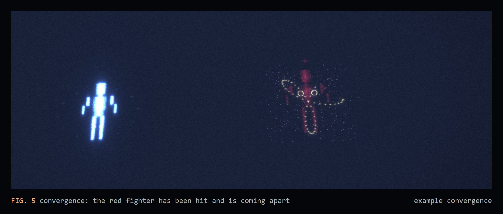
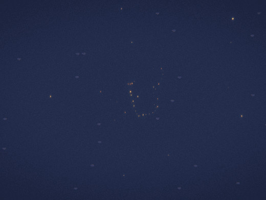
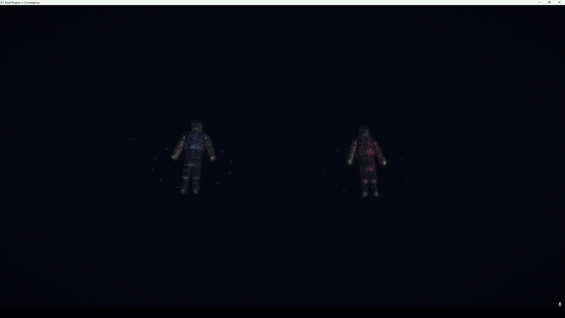
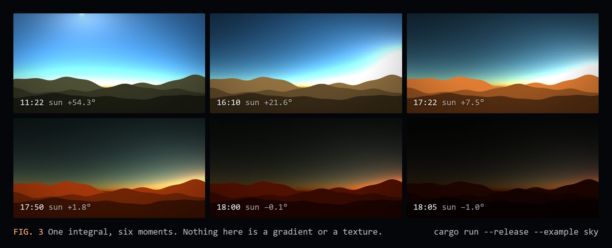
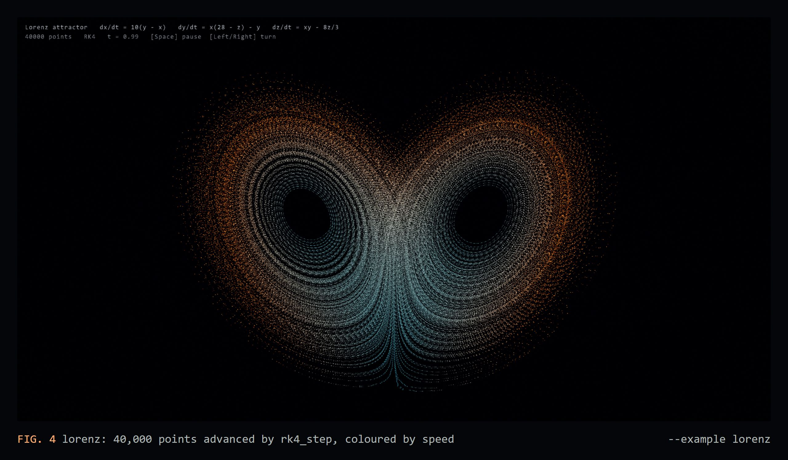

# Demos

[README](../README.md) · [Install](INSTALL.md) · [Demos](DEMOS.md) · [How it works](ARCHITECTURE.md) · [Capture](CAPTURE.md) · [Editor](EDITOR.md)

Every demo is one command from a clone, `cargo run --release --example <name>`, and the most popular ones are also prebuilt downloads that need no Rust: see [INSTALL.md](INSTALL.md).


Close the window (or press Esc where noted) to quit.



| Example | What you see |
| --- | --- |
| `sky` | A day passing over a mountain range. Every sky cell is the Nishita Rayleigh + Mie scattering integral for its view direction, recomputed each frame. Space pauses, Up/Down change speed, Esc quits. |
| `lorenz` | 40,000 points on the Lorenz attractor, integrated with RK4 and coloured by speed. Space pauses, Left/Right turn the view, Esc quits. |
| `galaxy` | About 3,000 glyphs on four spiral arms, each on its own orbit, with a hot core, red outer arms and drifting nebula dust. The camera circles slowly. Esc quits. |
| `strange_attractors` | Lorenz, Rossler, Chen, Halvorsen, Aizawa, Thomas and Dadras side by side, 1,500 points each. Space pauses, Esc quits. |
| `math_rain` | Digital rain made of mathematical symbols; column speeds from a sine, symbol flicker from a logistic map. Esc quits. |
| `quickstart` | The program from [Use it in 3 steps](../README.md#use-it-in-3-steps): 5,000 points that chaos tears apart into the Lorenz butterfly. |
| `convergence` | Two particle-built fighters in a circular arena with an orbiting camera; combat loops forever and hits knock matter loose. |
| `supernova` | A star pulses, collapses under a gravity field, explodes into debris and settles into a Lorenz-attractor nebula. |
| `hello_glyph` | The smallest program: one breathing `@` and a gravity field. |
| `playground` | Interactive sandbox: place glyphs, fields and entities with the mouse, cycle attractors and palettes. |
| `colossus` | GPU density entities: millions of particles derived in the vertex shader from sixteen bones. Needs a strong GPU. |
| `apotheosis` | A particle-rendered character built on signed distance fields, about 10.8 million GPU particles. Needs OpenGL 4.3 and a strong GPU. |

Also: `chaos_field`, `particle_demo`, `force_fields`, `amorphous_entity`, `particle_entity`, `full_combat`, `heartbeat`, `showcase` and `sculptor`.

<details>
<summary><b>More captures</b>: <code>supernova</code>, and an older <code>convergence</code> recording (4 MB)</summary>





</details>

## The quickstart program, frame by frame

These are real frames from that program, written by the engine itself (`PROOF_HIDDEN=1 PROOF_FIXED_DT=60 PROOF_SHOT=...`, see [CAPTURE.md](CAPTURE.md)), cropped to the centre:


The same idea at a larger scale, one command each:

| `strange_attractors` | `math_rain` |
| --- | --- |
|  |  |
| Seven chaotic systems, 1,500 RK4-integrated points each. Colour is speed along the flow. | A hundred columns at speeds from `abs(sin(0.13 c))`; each column's symbols flicker by its own logistic map. |
| **`lorenz`** | **`sky`** |
|  |  |
| 40,000 points on the Lorenz attractor, drawn into the HDR pass so overlaps add up to real light. | Every sky cell is a Rayleigh and Mie scattering integral, recomputed every frame as the sun moves. |

## The sky is an integral



The `sky` example divides the sky into 120 by 56 cells. For each cell, every frame, `nishita_sky::compute_sky_color` integrates Rayleigh and Mie single scattering along the view ray and along a second ray toward the sun. The blue at noon, the orange band at sunset and the dark teal after it all come out of the same integral as the sun moves. The mountains are sums of sines, lit by the sky just above the horizon. Space pauses, Up/Down change the speed of the day.

## Forty thousand points, one equation



Every point in the `lorenz` example is a state `(x, y, z)` advanced each frame by the engine's own RK4 integrator. Nobody drew the two wings; that is where the equations send the points. Colour is speed along the flow, and the points are drawn into the HDR world pass, so overlapping points add up to real light before bloom and the tonemap.

```rust
use proof_engine::math::attractors::rk4_step;

for p in points.iter_mut() {
    for _ in 0..SUBSTEPS {
        *p = rk4_step(AttractorType::Lorenz, *p, h);
    }
}
```

<details>
<summary><b>The <code>apotheosis</code> example</b></summary>

`examples/apotheosis.rs` is a standalone showcase of a particle-rendered character built on signed distance fields instead of meshes. A 26-bone capsule skeleton is blended with Inigo Quilez's polynomial smooth minimum, particles are importance-sampled onto the SDF shell, and normals, ambient occlusion and subsurface thickness are all computed from the SDF itself. On top of that it layers per-material shading (Schlick Fresnel, Kajiya-Kay hair and fabric specular, thin-film iridescence), a strand-based hair renderer, inertial lag for loose materials, and a post stack including TAA jitter, spectral bloom, god rays, depth of field bokeh and ACES tonemapping. It targets about 10.8 million GPU particles.

</details>
