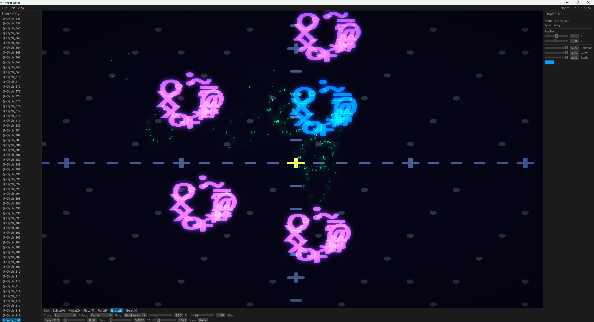

# Proof Editor

[README](../README.md) · [Install](INSTALL.md) · [Demos](DEMOS.md) · [How it works](ARCHITECTURE.md) · [Capture](CAPTURE.md) · [Editor](EDITOR.md)




Download [`proof-editor.exe`](https://gitlab.com/mattbusel/proof-engine/-/releases/permalink/latest/downloads/proof-editor.exe) for Windows (it is also inside every demos archive on the [latest release](https://gitlab.com/mattbusel/proof-engine/-/releases), for macOS and Linux too), or build it:

```bash
cd proof-engine/editor
cargo run --release
```

### Keys

| Key | Action |
| --- | --- |
| Click viewport | Place with current tool |
| WASD / arrows | Pan camera |
| V / G / P / F / E / X | Select, move, place glyph, place force field, place entity, particle burst |
| Shift+Click | Multi-select |
| Ctrl+C / Ctrl+V | Copy / paste |
| Ctrl+Z / Ctrl+Y | Undo / redo |
| Ctrl+S / Ctrl+O / Ctrl+N | Save / load / new scene |
| Delete | Remove selection |
| Space | Screen shake |
| F1 | Help |

